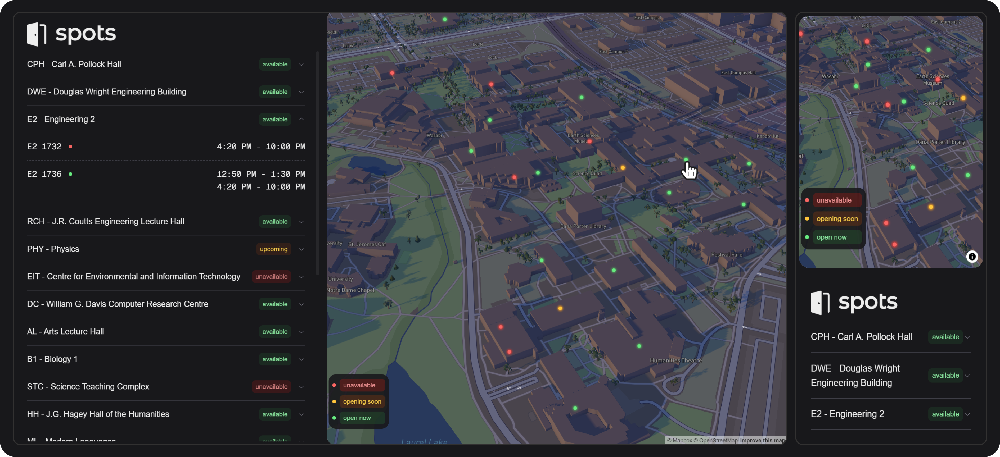

# Open Spots

**Open Spots** is a fork of [Spots](https://github.com/notAkki/spots) that is designed to help organization deliver real-time building availability data to staff, employees, customers, or students. Developers can create an API to deliver their own data to the Open Spots platform. This data can be visualized on an interactive map, and displayed available spots (rooms with time slots).

## Features

-   Displays open spots across an organization's building or campus.
-   Sorts spots based on proximity to the user’s current location.
-   Interactive map to visualize building locations.
-   List view of spots with real-time status updates (based on the organization's data).

## Tech Stack

### Frontend

-   **Next.js**: Handles server-side rendering and provides a robust React-based framework for building the frontend UI.
-   **Mapbox GL**: Provides the interactive map to display building locations.
-   **Tailwind CSS**: Used for styling the UI components with utility-first CSS for responsive and consistent design.
-   **Geolocation API**: Retrieves the user’s current location to sort spots by proximity.

### Backend

-   **Flask**: A lightweight Python web framework to handle API requests and logic for retrieving and processing spot data.
-   **Requests**: A Python library used in Flask to fetch spot data from external APIs.
-   **Haversine Formula**: Implemented in the backend to calculate the distance between the user and spot locations based on coordinates.

## API

There are a few different variables that can be set in the `.env` file to customize Open Spots.

-   `API_URL`: The URL of the API that will be used to fetch spot data. **Required**
-   `NEXT_PUBLIC_MAPBOX_ACCESS_TOKEN`: The Mapbox access token to be used for the map. **Required**
-   `NEXT_PUBLIC_MAPBOX_STYLE_URL`: The Mapbox style URL to be used for the map. **Required**
-   `NEXT_PUBLIC_STARTING_CENTER_COORDS`: The starting center coordinates to be used for the map. 
-   `NEXT_PUBLIC_STARTING_ZOOM`: The starting zoom level to be used for the map. 
-   `NEXT_PUBLIC_STARTING_PITCH`: The starting pitch level to be used for the map.

Your API should return a JSON object with the following fields:

-   `building`: The name of the building.
-   `building_code`: The code of the building.
-   `building_status`: The status of the building.
-   `rooms`: A dictionary of room numbers to room data.
-   `coords`: The coordinates of the building.
-   `distance`: The distance to the building from the user's current location.
-   `distance_unit`: The unit of distance ("mi" or "km")

The room data has the following fields:

-   `roomNumber`: The number of the room.
-   `slots`: An array of time slots for the room.

The slots data has the following fields:

-   `StartTime`: The start time of the time slot.
-   `EndTime`: The end time of the time slot.
-   `Status`: The status of the time slot.  

An example API response can be found in `backend/docs/example_api_response.json`.

## Local Setup

1. Install Docker and Docker Compose.
2. Run `make build up` to start the frontend and backend services.
